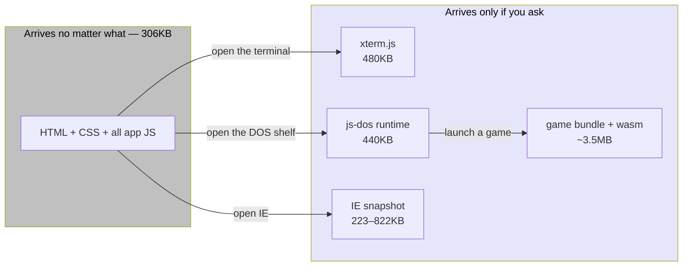
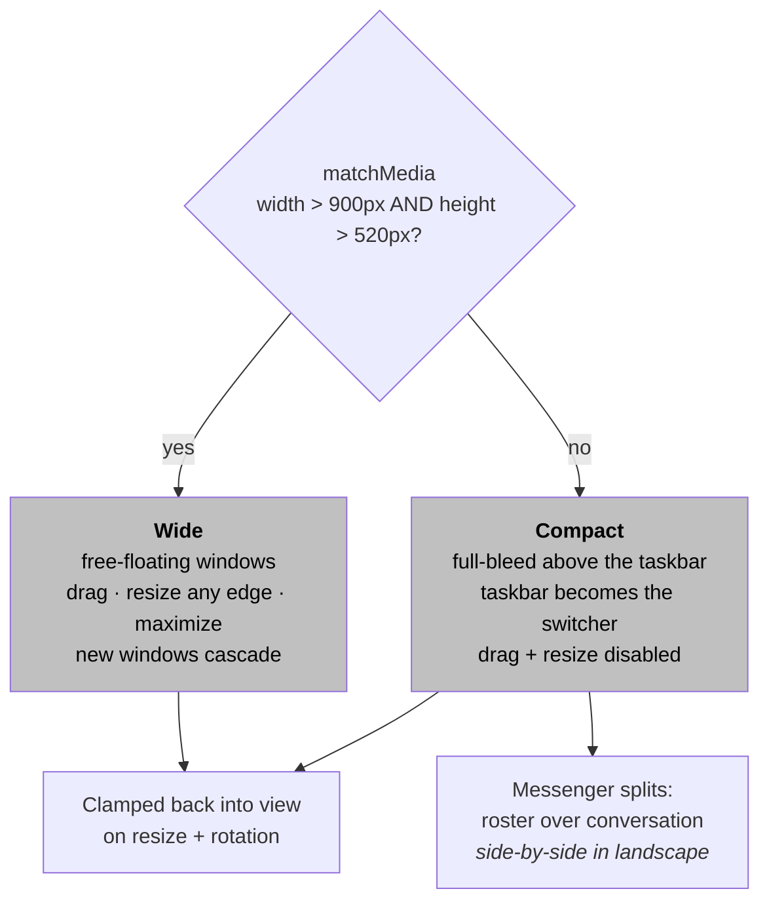
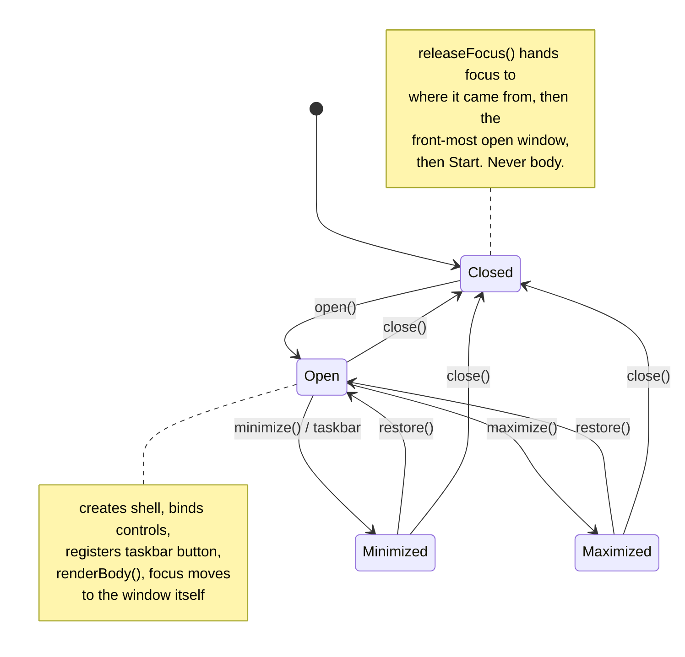
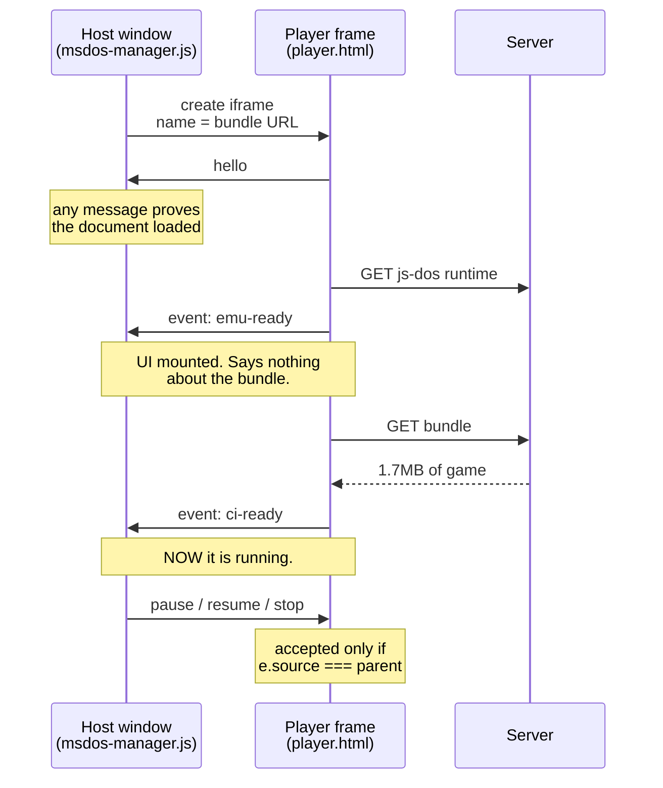
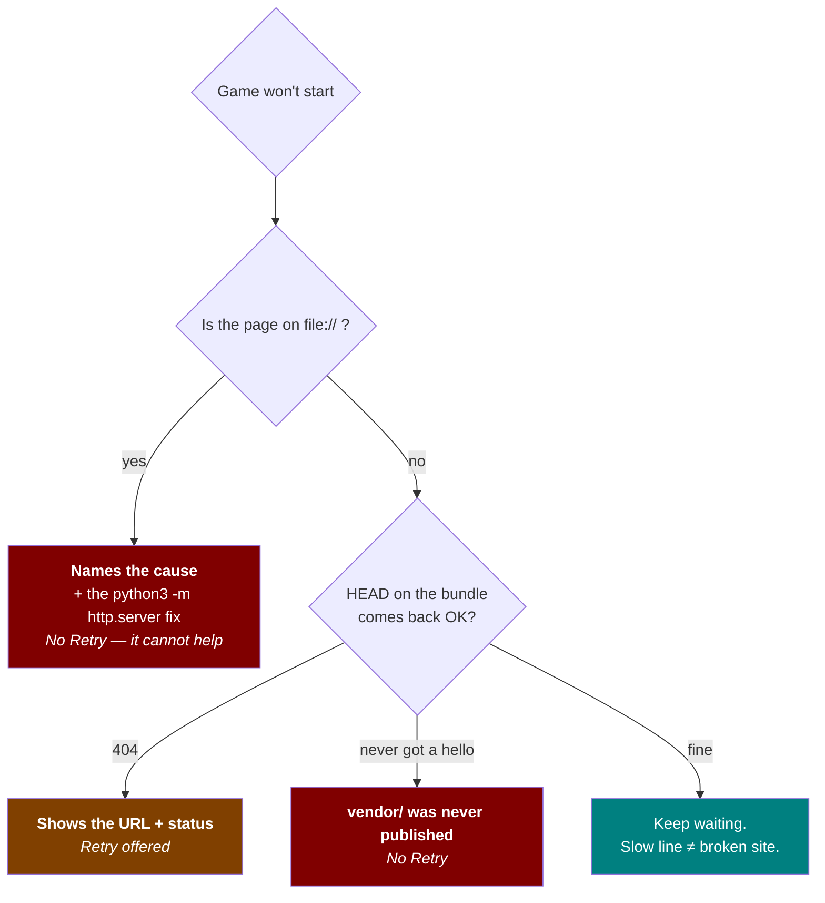

# Oxford Messenger

<!-- Under construction. Please sign the guestbook. -->


<sub>Badges are committed SVGs, not calls to a badge service — see
[`tools/build-badges.py`](tools/build-badges.py). A README that boasts about
making no third-party requests should not open with eight of them.</sub>

A playable recreation of a 1999 desktop: an AOL-style instant messenger, mail
client, Paint, media player, MS-DOS prompt and two real DOS games — all running
in the browser from static files.

No build step. No framework. No CDN. No tracking. No `<blink>`. (We thought
about `<blink>`.) Open `index.html` and it goes.

---

## ELI5

Y'know how a computer has little windows you can shove around the screen, and
each one's got a program in it? This is that. Except it's 1999, none of it is
real, and the whole shebang lives in a browser tab.

Nothing installs. Nothing phones home. You click a thing, a window opens, the
window does the thing it says on the tin.

Two of those windows are honest-to-goodness DOS games from the early nineties
that actually **run** — not videos of games, not screenshots. The games. You can
lose a child to dysentery and then go conquer the Babylonians, which is more or
less how everyone spent 1994 anyway.

That's the whole deal. There is no catch and there is no newsletter.

---

## Contents

- [Running it](#running-it)
- [What's in it](#whats-in-it)
- [How it boots](#how-it-boots)
- [Weight, or: what your modem is actually pulling down](#weight-or-what-your-modem-is-actually-pulling-down)
- [Layout](#layout)
- [Accessibility](#accessibility)
- [Architecture](#architecture)
- [Project structure](#project-structure)
- [The DOS games](#the-dos-games)
- [Checks](#checks)
- [Keyboard shortcuts](#keyboard-shortcuts)
- [Dependencies](#dependencies)
- [Browser support](#browser-support)
- [Licence](#licence)

---

## Running it

Any static file server will do the job:

```sh
npx http-server -p 8099 -c-1 .
# then point your browser at http://127.0.0.1:8099
```

Opening `index.html` straight off disk *mostly* works, but the DOS games and all
the sound do not, and that is not our fault — a browser flatly refuses to let a
`file://` page read other local files, so neither the game bundles nor the audio
can be fetched. The DOS player notices, says so in plain English, and hands you
the fix. It does not sit there spinning like it's 1996 and you're waiting on a
JPEG to paint in from the top down.

Deploying to GitHub Pages? Keep the `.nojekyll` file. Without it, Pages runs the
whole tree through Jekyll, Jekyll quietly drops `vendor` — which is where the
js-dos runtime and its WebAssembly emulators live — and every DOS game 404s on a
site that passed every local test. Ask us how we know.

There is nothing to install and nothing to build. The `package.json` is there
purely for the checks; the site itself ships zero dependencies and loads nothing
at runtime that isn't already in this repository. `tools/` wants Python 3 and the
checks want Node, but neither is required to *run* the thing.

---

## What's in it

Sign in with any name and any password — it's a museum piece, not an account
system, and the bouncer is not paid enough to care — then sit through the dial-up
sequence or skip it like a coward.

| App | What it does |
|---|---|
| **Oxford Messenger** | Buddy list plus an IM window. Thirteen buddies, four online; each replies in its own voice, types visibly before answering, and eventually drops a real link. The nine offline ones are disabled rather than hidden, because vanishing your friends is rude. History sticks around for the session. |
| **Oxford Mail** | Inbox and Sent, sortable by From/Subject/Date, reader pane with a toggleable preview, compose/reply/delete, mark read/unread, and a "check for new mail" that occasionally turns something up. Read state persists in `localStorage`. |
| **MS-DOS Prompt** | xterm.js with a genuine command set — `help`, `dir`, `cls`, `ver`, `time`, `date`, `oxford`, `whoami`, `dos`, `civ`, `oregon` — history on ↑/↓, and auto-fit to the window at any size. |
| **MS-DOS Games** | The Oregon Trail and Sid Meier's Civilization, under DOSBox via js-dos 8. The actual games, playable to the end, with save state, speed control and an on-screen keyboard. |
| **Oxford Paint** | Pencil and eraser, colour picker, brush size, undo/redo and save-as-PNG, over a base photograph. Mouse, finger and stylus all work. |
| **Internet Explorer** | Period-accurate chrome wrapped around a snapshot of the real Oxford course page. Click it and the live page opens in a new tab, which in 1999 would have been a new *window*, and you would have lost it behind the others. |
| **Oxford Channels** | Ten channel tiles opening an "Innovation & You" slide deck — ten slides with clipart, images and video links, wrapping at both ends. |
| **Media Player** | Windows-98-style player with seek, volume, a playlist that shows what's loaded, and a live audio visualiser driven by the Web Audio API. |
| **Folders** | Desktop folders whose contents open in the right app. Clips go to the media player, as nature intended. |

---

## How it boots

Nothing is eager. The desktop is inert until you sign in, and every app is a
subclass that shows up only when summoned.


A stuck sound can never strand anyone on the connection screen: there's a hard
20-second ceiling from "Sign In" to desktop no matter what the audio does. The
boxes and the "Connected" message run off **one** clock, because they used to run
off two and cheerfully contradicted each other.

---

## Weight, or: what your modem is actually pulling down

| When | What arrives |
|---|---|
| First load | ~306KB across 25 requests |
| Opening the terminal | ~480KB — the xterm.js engine and its stylesheet |
| Opening the DOS shelf | ~440KB — the js-dos runtime, prefetched at idle priority |
| Launching a game | ~1.7–1.9MB bundle plus ~1.7MB of DOSBox WebAssembly |
| Opening Internet Explorer | 223KB–822KB depending on your display |



Nothing below the first row is fetched until somebody actually opens that app, so
most visitors never pull down a byte of it.

The Internet Explorer snapshot ships at three widths and the element reports its
own measured width to the browser — so a laptop takes 223KB where a 2× display
takes 822KB. It used to be one 3.4MB PNG for everybody, which on a 56k line is
roughly eight and a half minutes. We fixed that.

---

## Layout

Two layout modes, flipped by a `matchMedia` listener in `main.js` that toggles
`body.is-compact`:



Drag and resize are switched off on small screens because they cannot be made to
work under a thumb, and pretending otherwise helps nobody. **Start → Show
Desktop** gets you back to the icons.

Windows get clamped back into view on resize and rotation, so nothing ends up
marooned off-screen. Every pointer interaction — window drag, window resize,
painting, the mail splitter — goes through Pointer Events, so mouse, touch and
stylus run one code path instead of three slightly different ones that all rot at
different speeds.

---

## Accessibility

Being period-accurate about the *look* is no excuse for being period-accurate
about the accessibility.

- Every control is a real `<button>` with an accessible name, reachable and
  operable by keyboard, with a visible focus ring.
- Each window is a named `region` and a focus target. Opening one moves focus to
  the window itself, so it announces its name and the next Tab lands inside it.
  Closing or minimizing hands focus back — to wherever it came from, then the
  front-most window still open, then the Start button. Never `<body>`.
- Targets meet the WCAG 2.5.8 (AA) 24×24px minimum, and get bigger on
  touch-primary devices.
- All text meets WCAG 1.4.3 contrast, verified by computing real ratios against
  the composited background rather than trusting a scan that shrugs and reports
  *incomplete* for anything it can't resolve.
- The CRT flicker runs at 0.25Hz — nowhere near the three-per-second limit in
  WCAG 2.3.1 — and all decorative motion is removed under
  `prefers-reduced-motion`.
- Live regions announce chat messages, mail status, player state and terminal
  output.
- `prefers-contrast: more` and a print stylesheet are both supported.

Two pieces of third-party UI that a visitor actually touches get held to the same
bar as everything else:

- **The DOS player.** js-dos draws its controls as bare `<div>`s with click
  handlers — no role, no name, no tab stop, a 16px rail and 20×20 radios. That's
  WCAG 2.1.1, 4.1.2 and 2.5.8 all failing in the only UI a player has for saving,
  speed, full screen and the on-screen keyboard. `vendor/jsdos/player.html` adds
  the lot, and puts the game canvas first in the frame's tab order so Enter and
  Space reach DOSBox instead of a button.
- **The terminal.** xterm renders to a canvas and marks its rows `aria-hidden`,
  so a screen-reader user could type `help` and hear precisely nothing.
  `TerminalManager` keeps a `role="log"` transcript of every line it writes,
  off-screen but announced.

---

## Architecture

Plain classic scripts. No bundler, no modules, no framework, no 400MB folder you
daren't look inside. Each file declares a class on `window`; `main.js` builds
them all inside a `safely()` wrapper, so one broken module costs you one feature
instead of the whole desktop.

### The window lifecycle

Every windowed app extends `AppWindow`, which owns creating the shell, wiring the
three title-bar buttons, registering a taskbar button, focus handling, and
minimize/restore/maximize/close. Subclasses implement `renderBody()` and,
if they need them, `onShow()`, `onHide()`, `onClose()` and `onResize()`.



Adding an app is a subclass, not another copy of the same six methods pasted in
and then subtly diverging over eighteen months.

Window visibility is the `.window--hidden` class rather than an inline `display`,
so the compact layout can own `display` without arm-wrestling inline styles
written by dragging and resizing.

### Sizing

Windows are flex columns: title bar is `flex: 0 0 auto`, body takes what's left.
Nothing derives a height from a magic `calc()` against a hard-coded title-bar
constant — which is exactly what used to snap the moment the real title bar
measured differently.

### Isolation

The DOS player runs inside a same-origin iframe rather than in the page. js-dos
ships a full Tailwind build whose preflight would strip every border the Windows
95 look is made of, plus a layout that assumes it owns the document. The frame
gives it the viewport it expects and gives the app back a hard boundary. Closing
the window removes the frame, which tears down the emulator, its worker, its
audio graph and its listeners in a single move. See
[`vendor/VERSIONS.md`](vendor/VERSIONS.md).

---

## Project structure

```
index.html                 markup shell; every script is deferred
main.css                   all styles, in numbered sections (see file header)
main.js                    boot, layout mode, clock, keyboard shortcuts
js/
  utils.js                 escaping, event delegation, layout maths
  buddies.js               the buddy roster: one source of truth
  app-window.js            AppWindow base class — the window lifecycle
  window-manager.js        window shells, pointer drag + resize
  taskbar-manager.js       taskbar buttons
  audio-manager.js         Howler wrapper; degrades to silence
  dialup-intro.js          sign-in + connection sequence
  chat-manager.js          messenger
  mail-manager.js          mail + compose
  terminal-manager.js      xterm.js prompt
  msdos-manager.js         DOS game shelf + player frame windows
  media-player-manager.js  audio/video player
  ie-manager.js            fake browser
  paint-manager.js         paint
  folder-manager.js        folder windows
  channels-manager.js      channels + slide deck
  start-menu.js            Start menu
  desktop-icons.js         desktop icon grid
  clipart.js               inline SVG clipart
  slides-data.js           slide deck content
checks/                    the browser-driven verification suite
  env.mjs                  where the site is, where shots go, how to launch
games/                     *.jsdos bundles, built by tools/
media/                     images, audio, video
vendor/                    all third-party code (see vendor/VERSIONS.md)
  jsdos/player.html        the page the DOS games run inside
tools/
  build-jsdos-bundles.py   build games/*.jsdos from the plain game directories
  check-jsdos-bundles.py   verify each bundle starts the program it names
```

---

## The DOS games

`games/*.jsdos` are built from the plain game directories, then verified:

```sh
python3 tools/build-jsdos-bundles.py
python3 tools/check-jsdos-bundles.py
```

A bundle needs js-dos metadata that a plain zip hasn't got: `.jsdos/dosbox.conf`,
`.jsdos/readme.txt`, `.jsdos/jsdos.json`, and an explicit `.jsdos/` **directory**
entry — without which the config never reaches the emulated filesystem and DOSBox
exits 101 before printing so much as a character.

Run the check every single time. A bundle can be flawlessly well-formed and still
boot to nothing but a `C:\>` prompt, because its `[autoexec]` names a program
that isn't in the archive — and nothing you can see in the player tells you which
of the two you're looking at. Measured against a bundle with a missing program,
DOSBox's own welcome banner scored *higher* on colour and on frame-to-frame
change than either real game, and its video mode matched Civilization's own text
menu. Eyeballing it is a mug's game. The archive is the only thing that can
answer the question, so the archive is what the check reads.

### When a game will not start

The emulator lives in `vendor/jsdos/player.html`, a same-origin frame the host
talks to over `postMessage`. Here's the whole conversation:



Three failures used to look identical from the outside — a spinner reading
"Loading DOS environment…" — and each one now names itself within seconds:



Three details make that work, and every one of them was a bug in its own right:

- **`ci-ready`, not `emu-ready`, means the game is running.** `emu-ready` fires
  the instant the js-dos UI mounts and says nothing whatsoever about whether the
  bundle will ever turn up. Treating it as success let a failed download swan
  about pretending to be a booted game.
- **`postMessage` has no usable target origin for a `file://` page.** Chrome
  reports `location.origin` as `"file://"` there, but messages are matched
  against the document's *real* origin, which is opaque — so addressing it
  silently bins every message, with a console warning rather than a throw that a
  `try`/`catch` could catch. Both directions fall back to `"*"`, and authenticity
  comes from `e.source` — the identity of the sending window — instead of the
  origin string.

  Both directions have to check it, which was not true at first. The host had
  always verified `e.source === frame.contentWindow`; the player checked only the
  origin, which the fallback above makes unconditionally true off disk. Its
  `source: 'jsdos-host'` field is a routing tag, not a credential — anyone can
  type that string — so until the player also checked `e.source === parent`, any
  window holding a handle to the frame could stop the emulator. `npm run
  check:origin` holds both halves to account, and is verified to fail against a
  player with the check taken out.
- **js-dos catches its own download failure and merely logs it.** No exception,
  no rejection, nothing to listen for. So the player asks the server the same
  question itself — but only once the answer is overdue, so a healthy launch
  never spends the extra request, and only a definitive negative is ever
  reported. A slow connection is not a broken one.

---

## Checks

The site itself has no dependencies and no build. The checks do, so they live
behind a `package.json` that the site never touches:

```sh
npm install                  # playwright, axe-core, pngjs, eslint, http-server
npx playwright install chromium
npm run serve                # http://127.0.0.1:8099, in another shell
```

Then, fastest to slowest:

| Command | What it covers |
| --- | --- |
| `npm run lint` | ESLint over `js/`, `main.js` and `checks/` |
| `npm run check:bundles` | Each bundle starts the program it names (no browser needed) |
| `npm run check:dialup` | Sign-on with and without audio; the three figures are drawn and stay legible right through the fill |
| `npm run check:dos` | Both games boot, take keystrokes, minimize, restore, relaunch; all three failure modes report correctly |
| `npm run check:axe` | axe-core over the whole site and inside the DOS player |
| `npm run check:keyboard` | Keyboard-only pass, checking where focus lands |
| `npm run check:play` | Fifteen scenarios driven end to end as a person would |
| `npm run check:audit` | Visual probes, tap targets, contrast and overflow at three viewports |
| `npm run check:origin` | The host↔player control channel obeys the host and ignores a third window |
| `npm run check:interact` | The full suite — 211 steps across three viewports |

`npm run check:dos-file` is kept separate because it deliberately opens the site
over `file://` to prove the DOS player explains itself instead of hanging.

Screenshots land in `checks/out/`, which is git-ignored. `BASE` overrides the
server URL, so the same checks run against a deploy:
`BASE=https://example.com npm run check:audit`.

**The browser is not configurable, on purpose.** These checks assert on pixels —
contrast ratios, what the emulator actually drew, whether a control is covered by
something else — and pointed at a build that doesn't match the installed
Playwright, those numbers look authoritative while meaning absolutely nothing.
Playwright is pinned and the browser comes with it.

Beyond the first two, the site is verified by driving a real browser — headed
Chromium, real mouse, real touch events, real keystrokes, never scripted calls
into the page. JavaScript is used only to *read* state back for assertions.

At 1440×900, 820×1180 and 390×844:

- **Every app opened, used and closed** — a conversation held and answered, a
  message read, sorted, composed and found again in Sent, all ten slides paged
  through and wrapped at both ends, a stroke drawn in Paint and undone exactly,
  every terminal command run and its output checked, Civilization booted and
  driven three prompts deep by keyboard, then minimized, restored and closed.
- **A visual probe on every screenshot** — off-screen windows, text clipped by
  its own box or by an ancestor, controls hiding under the taskbar, scrollers
  that extend past their window, controls covered by something else, real WCAG
  contrast ratios, and horizontal page overflow.
- **axe-core** (WCAG 2.0/2.1/2.2 A and AA, plus best-practice) on the sign-in
  screen, the bare desktop, with every app open, and inside the DOS player with
  its sidebar, settings, speed panel and on-screen keyboard open.
- **A keyboard-only pass** — sign in, reach the Start button, open every app,
  operate it and close it without laying a finger on the mouse, checking where
  focus lands at every step.
- **The dial-up sequence with and without audio**, because the two used to run
  off different clocks and the silent path announced "Connected" while the
  progress boxes were still filling.

Zero failures, zero visual defects, zero console errors, zero horizontal
overflow, zero axe violations.

### A word on checks that lie

A check that agrees with itself proves nothing, and this repo has been bitten
three times:

- Paint's "did anything get drawn" summed **RGB on a black stroke over a
  transparent canvas** — zero either way. It now counts alpha.
- The emulator's "is it painting" read a WebGL canvas back through `drawImage`,
  which returns transparent black without `preserveDrawingBuffer`. It now
  screenshots the element, because the compositor has the real pixels.
- `check:origin` originally asserted against **its own copy** of the trust rule,
  and passed cleanly against a player with the check ripped out.

So the rule around here: every check that guards a fix must be run against the
*unfixed* code and seen to go red. `check:origin` carries that as a built-in
control — it also asserts that the host's own `stop` **does** kill the emulator,
because "still running" is worthless evidence if the check can't detect a stop at
all.

Only Chromium is available in the environment used for those runs, so Firefox and
Safari have not been exercised automatically. Nothing in the code is
engine-specific — the APIs used (Pointer Events, `dvh`, `env()`, `matchMedia`,
`:focus-visible`, `inert`) are supported across every current engine — but that's
reasoning, not evidence, and we're not going to dress it up as the latter.

---

## Keyboard shortcuts

| Keys | Action |
|---|---|
| `Ctrl`/`Cmd` + `T` | Open the MS-DOS prompt |
| `Esc` | Skip the dial-up sequence; close the Start menu |
| `Enter` | Send a chat message; activate the focused control |
| `↑` / `↓` | Command history in the terminal; move through the Start menu |
| `←` / `→` | Previous/next slide; resize the mail splitter when focused |
| `Ctrl` + `Z` / `Y` | Undo / redo in Paint |
| `Tab` | Into the focused window, then through its controls |

---

## Dependencies

Everything is vendored under `vendor/`. There are **no runtime requests to any
third party** — so the site works offline, behind a firewall, with an ad-blocker
on, and doesn't so much as flinch when somebody's CDN falls over. It also means
no SRI hashes to rotate and nobody out there watching who visits.

| Asset | Version |
|---|---|
| [`@xterm/xterm`](https://www.npmjs.com/package/@xterm/xterm) | 6.0.0 |
| [`@xterm/addon-fit`](https://www.npmjs.com/package/@xterm/addon-fit) | 0.11.0 |
| [`howler`](https://www.npmjs.com/package/howler) | 2.2.4 |
| [`js-dos`](https://js-dos.com/) | 8.4.1 |

Refresh instructions, the reasoning behind the DOS player's isolation, and what
`player.html` fixes on js-dos's behalf are all in
[`vendor/VERSIONS.md`](vendor/VERSIONS.md).

---

## Browser support

Current Chrome, Edge, Firefox and Safari, on desktop, tablet and phone. No
"Best Viewed In" button required, and no 800×600 disclaimer.

The `.mp4` clips are H.264, so they want a browser built with that codec — every
mainstream one has it, but a bare open-source Chromium build may not. When the
browser can't decode a file, the player says so out loud, resets its readout, and
flatly refuses to pretend the transport buttons are accomplishing anything.

With no audio — muted, or Howler missing entirely — every sound becomes a no-op
that still fires its completion callback, so nothing that chains on a sound can
stall. The dial-up sequence shortens to suit rather than sitting there in
silence pretending to hear a modem.

---

## Licence

For educational and nostalgic purposes only. AOL, AIM, Windows and the games are
trademarks of their respective owners, none of whom were consulted and all of
whom were doing much better in 1999.
