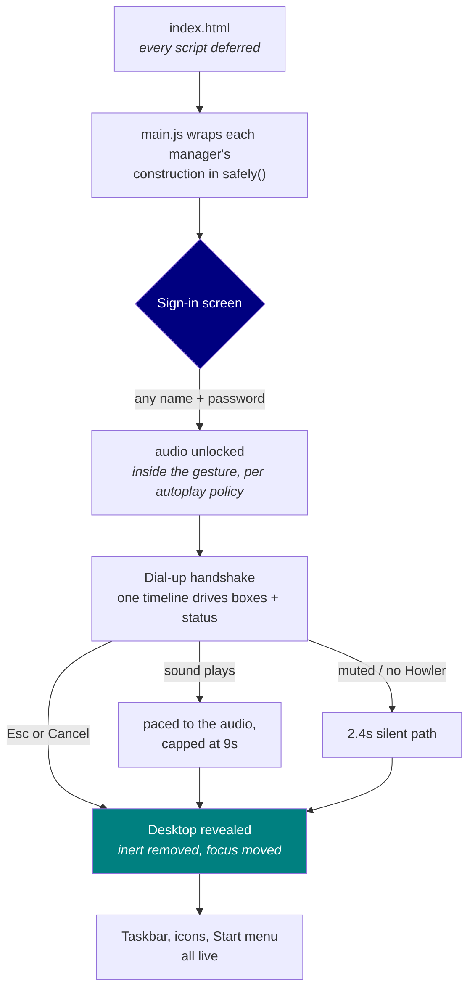
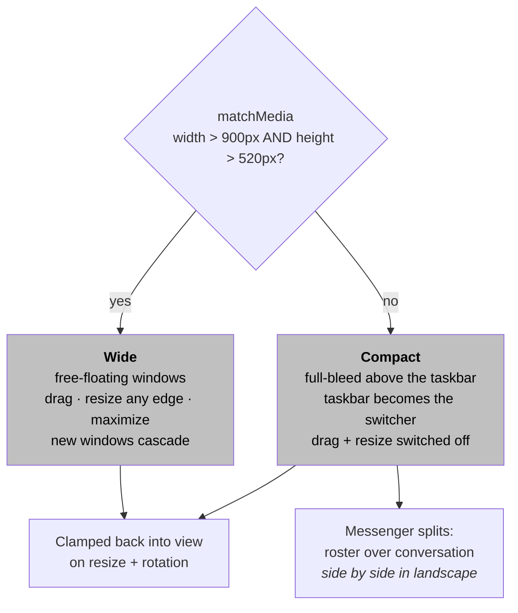
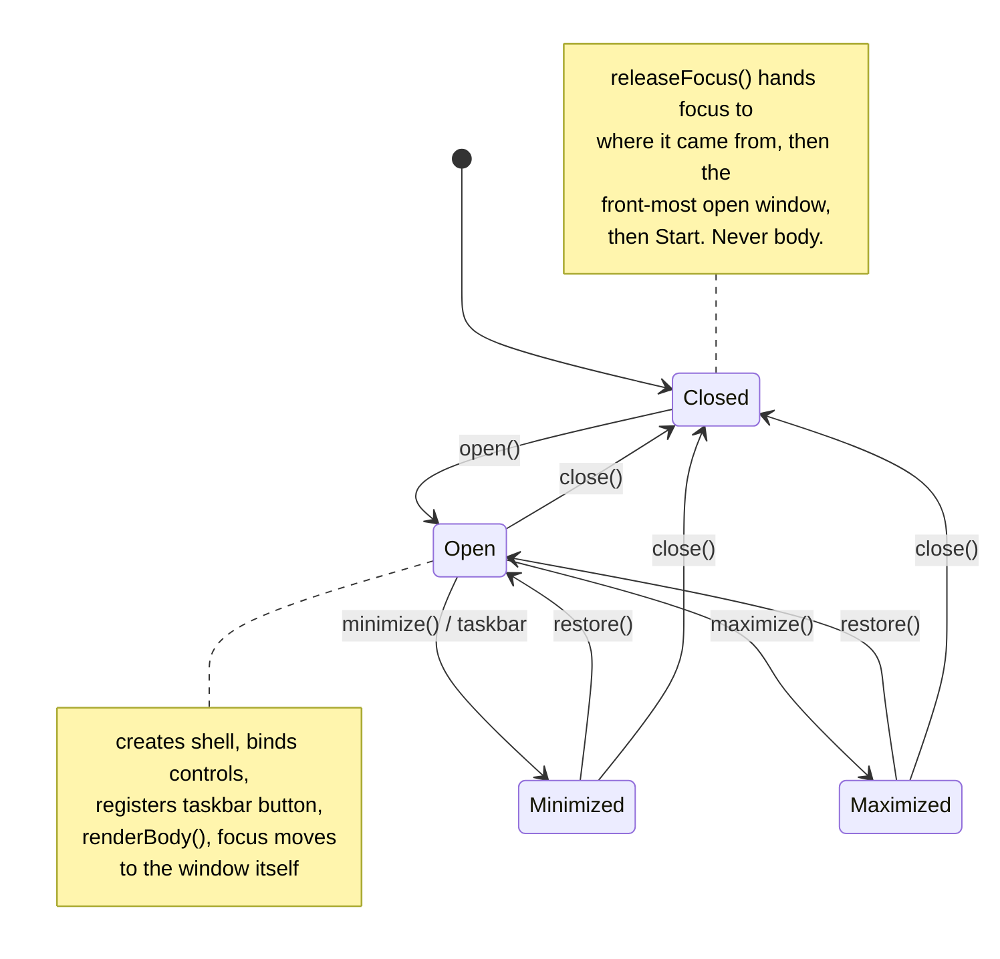
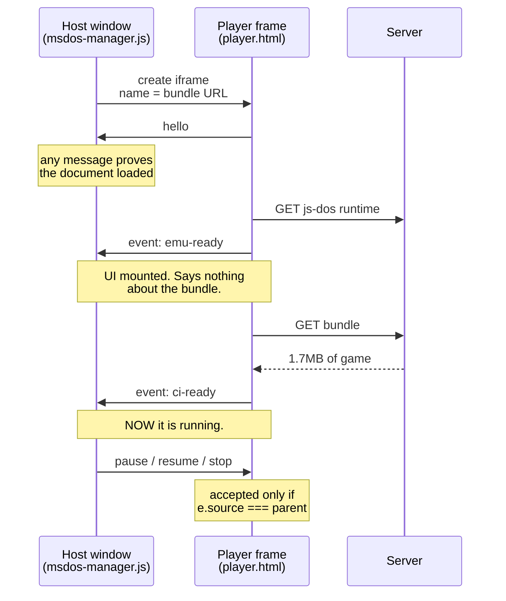
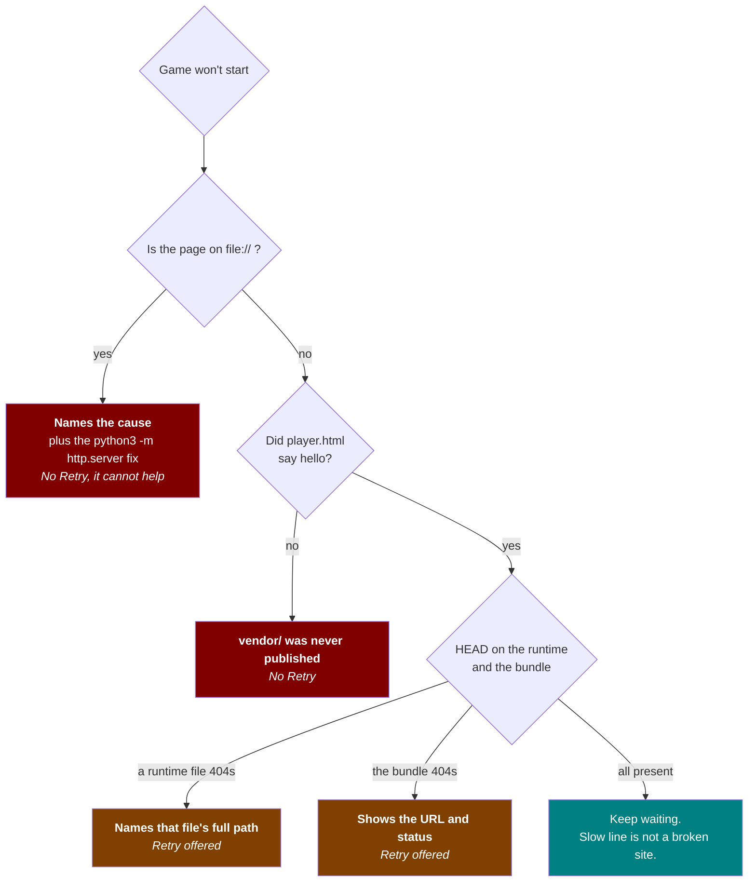

# Oxford Messenger

<!-- This page is UNDER CONSTRUCTION. Please sign the guestbook on your way out. -->


A playable recreation of a 1999 desktop, running in a browser off static files:
an AOL-style instant messenger, a mail client, Paint, a media player, an MS-DOS
prompt, and two honest-to-goodness DOS games.

No build step. No framework. No CDN. No tracking. No `<blink>`. Open
`index.html` and away it goes.

---

## ELI5

A computer has little windows you can shove around the screen, and each one has
a program in it. This is that. Except it's 1999, none of it is real, and the
whole shebang lives in a browser tab.

Nothing installs. Nothing phones home. You click a thing, a window opens, the
window does the thing it says on the tin.

Two of those windows are actual DOS games from the early nineties, and they
actually run. Not videos of games. Not screenshots. The games. You can lose a
kid to dysentery and then go conquer the Babylonians, which is pretty much how
everybody spent 1994.

That's the whole enchilada. No catch, no newsletter, no popup asking you to
subscribe.

---

## Contents

- [Logging on](#logging-on)
- [What's on the desktop](#whats-on-the-desktop)
- [How it boots](#how-it-boots)
- [What your modem pulls down](#what-your-modem-pulls-down)
- [Layout](#layout)
- [Accessibility](#accessibility)
- [Architecture](#architecture)
- [Project structure](#project-structure)
- [The DOS games](#the-dos-games)
- [Checks](#checks)
- [Keyboard shortcuts](#keyboard-shortcuts)
- [Dependencies](#dependencies)
- [Browser support](#browser-support)
- [Licence](#licence)

---

## Logging on

Any static file server does the job:

```sh
npx http-server -p 8099 -c-1 .
# then surf on over to http://127.0.0.1:8099
```

Opening `index.html` straight off disk mostly works, but the DOS games and the
sound do not. A browser flat out refuses to let a `file://` page read other
local files, so the game bundles and the audio never arrive. The DOS player
spots this, says so in plain English, and hands over the fix.

Putting this on GitHub Pages? Keep the `.nojekyll` file. Without it, Pages runs
the tree through Jekyll, Jekyll drops the `vendor` folder where the js-dos
runtime and its WebAssembly emulators live, and every DOS game 404s on a site
that worked a treat locally.

To find out whether a deployment is serving everything, point this at it:

```sh
BASE=https://example.com/innovation-oxford npm run check:deploy
```

It asks for all 38 files the site loads, the lazy ones included, and names
anything that comes back wrong. No browser required.

There is nothing to install and nothing to build. The `package.json` is there
for the checks only. The site ships zero dependencies and loads nothing at
runtime that isn't already in this repo. `tools/` wants Python 3 and the checks
want Node, but neither is needed to *run* the thing.

---

## What's on the desktop

Log on with any screen name and any password. It's a museum piece, not an
account system, so the bouncer is not paid enough to care. Then sit through the
dial-up handshake, or bail out with `Esc`.

| App | What it does |
|---|---|
| **Oxford Messenger** | Buddy list plus an IM window. Thirteen buddies, four of them online. Each one answers in its own voice, types visibly before replying, and eventually drops a real link. The nine offline buddies are disabled rather than hidden. History sticks around for the session. |
| **Oxford Mail** | Inbox and Sent, sortable by From, Subject or Date. Reader pane with a toggleable preview, compose, reply, delete, mark read and unread, plus a "check for new mail" that now and then turns something up. Read state lives in `localStorage`. |
| **MS-DOS Prompt** | xterm.js with a real command set: `help`, `dir`, `cls`, `ver`, `time`, `date`, `oxford`, `whoami`, `dos`, `civ`, `oregon`. History on ↑ and ↓, and auto-fit to the window at any size. |
| **MS-DOS Games** | The Oregon Trail and Sid Meier's Civilization, under DOSBox via js-dos 8. The real games, playable to the end, with save state, speed control and an on-screen keyboard. |
| **Oxford Paint** | Pencil and eraser, colour picker, brush size, undo, redo, save as PNG, over a base photograph. Mouse, finger and stylus all work. |
| **Internet Explorer** | Period-accurate chrome wrapped round a snapshot of the real Oxford course page. Click it and the live page opens in a new tab, which back then would have been a whole new window, and you'd have lost it behind the others. |
| **Oxford Channels** | Ten channel tiles opening an "Innovation & You" slide deck. Ten slides of clipart, images and video links, wrapping at both ends. |
| **Media Player** | Windows-98-style player with seek, volume, a playlist showing what's loaded, and a live audio visualiser off the Web Audio API. |
| **Folders** | Desktop folders whose contents open in the right app. Clips go to the media player, as nature intended. |

---

## How it boots

Nothing loads early. The desktop stays inert until you log on, and every app is
a subclass that turns up only when summoned.



There is a hard 20-second ceiling from "Sign In" to desktop whatever the audio
does, so a stuck sound can't strand anybody on the connection screen. The
progress boxes and the "Connected" message run off one clock, so they can't
contradict each other.

---

## What your modem pulls down

| When | What arrives |
|---|---|
| First load | ~306KB across 25 requests |
| Opening the terminal | ~480KB, the xterm.js engine and its stylesheet |
| Opening the DOS shelf | ~440KB, the js-dos runtime, prefetched at idle priority |
| Launching a game | ~1.7 to 1.9MB bundle plus ~1.7MB of DOSBox WebAssembly |
| Opening Internet Explorer | 223KB to 822KB depending on the display |


Nothing below the first row is fetched until somebody opens that app, so most
visitors never pull down a byte of it.

The Internet Explorer snapshot ships at three widths, and the element reports
its own measured width to the browser. A laptop takes 223KB where a 2× display
takes 822KB. On a 28.8 that's the difference between a coffee and a nap.

---

## Layout

Two layout modes, flipped by a `matchMedia` listener in `main.js` that toggles
`body.is-compact`:



Drag and resize are off on small screens because they can't be made to work
under a thumb. **Start → Show Desktop** gets you back to the icons.

Windows get clamped back into view on resize and rotation, so nothing ends up
marooned off-screen. Every pointer interaction, window drag, window resize,
painting and the mail splitter, runs through Pointer Events. Mouse, touch and
stylus take one code path instead of three.

---

## Accessibility

The look is period-accurate. The accessibility is not.

- Every control is a real `<button>` with an accessible name, reachable and
  operable by keyboard, with a visible focus ring.
- Each window is a named `region` and a focus target. Opening one moves focus
  to the window itself, so it announces its name and the next Tab lands inside
  it. Closing or minimizing hands focus back: to wherever it came from, then
  the front-most window still open, then the Start button. Never `<body>`.
- Targets meet the WCAG 2.5.8 (AA) 24×24px minimum, and get bigger on
  touch-primary devices.
- All text meets WCAG 1.4.3 contrast, measured as real ratios against the
  composited background.
- The CRT flicker runs at 0.25Hz, nowhere near the three-per-second limit in
  WCAG 2.3.1, and all decorative motion is removed under
  `prefers-reduced-motion`.
- Live regions announce chat messages, mail status, player state and terminal
  output.
- `prefers-contrast: more` and a print stylesheet are both supported.

Two pieces of third-party UI that a visitor actually touches are held to the
same bar as everything else:

- **The DOS player.** js-dos draws its controls as bare `<div>`s with click
  handlers: no role, no name, no tab stop, a 16px rail and 20×20 radios. That
  fails WCAG 2.1.1, 4.1.2 and 2.5.8 in the only UI a player has for saving,
  speed, full screen and the on-screen keyboard. `vendor/jsdos/player.html`
  supplies all of it, and puts the game canvas first in the frame's tab order
  so Enter and Space reach DOSBox instead of a button.
- **The terminal.** xterm renders to a canvas and marks its rows `aria-hidden`,
  so a screen-reader user could type `help` and hear nothing at all.
  `TerminalManager` keeps a `role="log"` transcript of every line it writes,
  off-screen but announced.

---

## Architecture

Plain classic scripts. No bundler, no modules, no framework, no 400MB folder
you daren't look inside. Each file declares a class on `window`, and `main.js`
builds them all inside a `safely()` wrapper, so a broken module costs one
feature rather than the whole desktop.

### The window lifecycle

Every windowed app extends `AppWindow`, which owns creating the shell, wiring
the three title-bar buttons, registering a taskbar button, focus handling, and
minimize, restore, maximize and close. Subclasses implement `renderBody()`,
plus `onShow()`, `onHide()`, `onClose()` and `onResize()` if they need them.



Adding an app means writing a subclass.

Window visibility is the `.window--hidden` class rather than an inline
`display`, which leaves `display` free for the compact layout to set.

### Sizing

Windows are flex columns. The title bar is `flex: 0 0 auto` and the body takes
what's left. No height is derived from a `calc()` against a hard-coded
title-bar constant, so nothing snaps when the real title bar measures
differently.

### Isolation

The DOS player runs inside a same-origin iframe rather than in the page. js-dos
ships a full Tailwind build whose preflight would strip every border the
Windows 95 look is made of, plus a layout that assumes it owns the document.
The frame gives it the viewport it expects and gives the app back a hard
boundary. Closing the window removes the frame, which tears down the emulator,
its worker, its audio graph and its listeners in one go. See
[`vendor/VERSIONS.md`](vendor/VERSIONS.md).

---

## Project structure

```
index.html                 markup shell; every script is deferred
main.css                   all styles, in numbered sections (see file header)
main.js                    boot, layout mode, clock, keyboard shortcuts
js/
  utils.js                 escaping, event delegation, layout maths
  buddies.js               the buddy roster: one source of truth
  app-window.js            AppWindow base class, the window lifecycle
  window-manager.js        window shells, pointer drag + resize
  taskbar-manager.js       taskbar buttons
  audio-manager.js         Howler wrapper; degrades to silence
  dialup-intro.js          sign-in + connection sequence
  chat-manager.js          messenger
  mail-manager.js          mail + compose
  terminal-manager.js      xterm.js prompt
  msdos-manager.js         DOS game shelf + player frame windows
  media-player-manager.js  audio/video player
  ie-manager.js            fake browser
  paint-manager.js         paint
  folder-manager.js        folder windows
  channels-manager.js      channels + slide deck
  start-menu.js            Start menu
  desktop-icons.js         desktop icon grid
  clipart.js               inline SVG clipart
  slides-data.js           slide deck content
checks/                    the browser-driven verification suite
  env.mjs                  where the site is, where shots go, how to launch
games/                     *.jsdos bundles, built by tools/
media/                     images, audio, video
vendor/                    all third-party code (see vendor/VERSIONS.md)
  jsdos/player.html        the page the DOS games run inside
tools/
  build-badges.py          the README badges, as local SVGs
  build-jsdos-bundles.py   build games/*.jsdos from the plain game directories
  check-jsdos-bundles.py   verify each bundle starts the program it names
```

---

## The DOS games

`games/*.jsdos` are built from the plain game directories, then verified:

```sh
python3 tools/build-jsdos-bundles.py
python3 tools/check-jsdos-bundles.py
```

A bundle needs js-dos metadata that a plain zip hasn't got:
`.jsdos/dosbox.conf`, `.jsdos/readme.txt`, `.jsdos/jsdos.json`, and an explicit
`.jsdos/` **directory** entry. Without that directory entry the config never
reaches the emulated filesystem and DOSBox exits 101 before printing a
character.

Run the check every time. A bundle can be perfectly well-formed and still boot
to nothing but a `C:\>` prompt, because its `[autoexec]` names a program that
isn't in the archive. Nothing visible in the player tells the two apart, so the
check reads the archive and confirms the program is in there.

### When a game won't start

The emulator lives in `vendor/jsdos/player.html`, a same-origin frame the host
talks to over `postMessage`. Here is the whole conversation:



The player reports its own failures rather than leaving a spinner up. Three
cases, each named in the window within seconds:



Three details make that work:

- **`ci-ready` means the game is running. `emu-ready` does not.** `emu-ready`
  fires the moment the js-dos UI mounts and says nothing about whether the
  bundle will ever turn up.
- **A `file://` page has no usable target origin for `postMessage`.** Chrome
  reports `location.origin` as `"file://"` there, but messages match against
  the document's real origin, which is opaque, so addressing it silently bins
  every message. It warns to the console rather than throwing, so a
  `try`/`catch` never sees it. Both directions fall back to `"*"`, and
  authenticity comes from `e.source`, the identity of the sending window,
  rather than the origin string. Both sides check it: the host verifies
  `e.source === frame.contentWindow`, and the player verifies
  `e.source === parent`. The `source: 'jsdos-host'` field is a routing tag and
  not a credential, since any sender can type that string.
  `npm run check:origin` holds both halves to account.
- **js-dos catches some of its own download failures and only logs them.** No
  exception, no rejection, nothing to listen for. So the player asks the server
  the same questions itself, covering all five runtime files under
  `vendor/jsdos/emulators/` as well as the bundle. Those requests only go out
  once the answer is overdue, so a healthy launch never spends them, and only a
  definitive negative is reported, so a slow line is never mistaken for a
  broken site. A missing runtime file is named by its full path: js-dos reports
  it relative to `player.html`, which is not where anyone would go looking.

---

## Checks

The site has no dependencies and no build. The checks do, so they live behind a
`package.json` the site never touches:

```sh
npm install                  # playwright, axe-core, pngjs, eslint, http-server
npx playwright install chromium
npm run serve                # http://127.0.0.1:8099, in another shell
```

Then, fastest to slowest:

| Command | What it covers |
| --- | --- |
| `npm run lint` | ESLint over `js/`, `main.js` and `checks/` |
| `npm run check:bundles` | Each bundle starts the program it names (no browser needed) |
| `npm run check:dialup` | Sign-on with and without audio; the three figures are drawn and stay legible right through the fill |
| `npm run check:dos` | Both games boot, take keystrokes, minimize, restore, relaunch; all three failure modes report correctly |
| `npm run check:axe` | axe-core over the whole site and inside the DOS player |
| `npm run check:keyboard` | Keyboard-only pass, checking where focus lands |
| `npm run check:play` | Fifteen scenarios driven end to end as a person would |
| `npm run check:audit` | Visual probes, tap targets, contrast and overflow at three viewports |
| `npm run check:origin` | The host and player control channel obeys the host and ignores a third window |
| `npm run check:deploy` | A deployment is serving all 38 files the site loads (no browser needed) |
| `npm run check:interact` | The full suite, 211 steps across three viewports |

`npm run check:dos-file` opens the site over `file://` and checks the DOS
player reports the reason rather than hanging. It is separate from the rest
because it needs no server.

Screenshots land in `checks/out/`, which is git-ignored. `BASE` overrides the
server URL, so the same checks run against a deploy:
`BASE=https://example.com npm run check:audit`.

Playwright is pinned, and the browser it installs is the one the checks use.
There is no setting for pointing them at a different build.

Past the first two, the site is verified by driving a real browser: headed
Chromium, real mouse, real touch events, real keystrokes, never scripted calls
into the page. JavaScript is used only to *read* state back for assertions.

At 1440×900, 820×1180 and 390×844:

- **Every app opened, used and closed.** A conversation held and answered. A
  message read, sorted, composed and found again in Sent. All ten slides paged
  through and wrapped at both ends. A stroke drawn in Paint and undone exactly.
  Every terminal command run and its output checked. Civilization booted and
  driven three prompts deep by keyboard, then minimized, restored and closed.
- **A visual probe on every screenshot.** Off-screen windows, text clipped by
  its own box or by an ancestor, controls hiding under the taskbar, scrollers
  running past their window, controls covered by something else, real WCAG
  contrast ratios, and horizontal page overflow.
- **axe-core** (WCAG 2.0, 2.1 and 2.2, A and AA, plus best-practice) on the
  sign-in screen, the bare desktop, with every app open, and inside the DOS
  player with its sidebar, settings, speed panel and on-screen keyboard open.
- **A keyboard-only pass.** Log on, reach the Start button, open every app,
  operate it and close it without touching the mouse, checking where focus
  lands at every step.
- **The dial-up handshake with and without audio**, since the silent path runs
  on a different budget from the audible one.

Zero failures, zero visual defects, zero console errors, zero horizontal
overflow, zero axe violations.

Each check that guards a fix is also run against the unfixed code and confirmed
to fail there. Several carry that control inline: `check:origin` asserts both
that a forged `stop` is ignored and that the host's own `stop` is obeyed.

Firefox and Safari are not exercised automatically, since only Chromium is
available where these run. The APIs the site uses (Pointer Events, `dvh`,
`env()`, `matchMedia`, `:focus-visible`, `inert`) are supported across every
current engine.

---

## Keyboard shortcuts

| Keys | Action |
|---|---|
| `Ctrl`/`Cmd` + `T` | Open the MS-DOS prompt |
| `Esc` | Skip the dial-up handshake; close the Start menu |
| `Enter` | Send a chat message; activate the focused control |
| `↑` / `↓` | Command history in the terminal; move through the Start menu |
| `←` / `→` | Previous and next slide; resize the mail splitter when focused |
| `Ctrl` + `Z` / `Y` | Undo and redo in Paint |
| `Tab` | Into the focused window, then through its controls |

---

## Dependencies

Everything is vendored under `vendor/`. There are **no runtime requests to any
third party**, so the site works offline, behind a firewall, with an ad-blocker
running, and doesn't so much as flinch when somebody's CDN falls over.

| Asset | Version |
|---|---|
| [`@xterm/xterm`](https://www.npmjs.com/package/@xterm/xterm) | 6.0.0 |
| [`@xterm/addon-fit`](https://www.npmjs.com/package/@xterm/addon-fit) | 0.11.0 |
| [`howler`](https://www.npmjs.com/package/howler) | 2.2.4 |
| [`js-dos`](https://js-dos.com/) | 8.4.1 |

Refresh instructions, the reasoning behind the DOS player's isolation, and what
`player.html` supplies on js-dos's behalf are all in
[`vendor/VERSIONS.md`](vendor/VERSIONS.md).

---

## Browser support

Current Chrome, Edge, Firefox and Safari, on desktop, tablet and phone. No
"Best Viewed In Netscape Navigator 4.0" button required, and no 800×600
disclaimer.

The `.mp4` clips are H.264, so they want a browser built with that codec. Every
mainstream one has it, though a bare open-source Chromium build may not. When
the browser can't decode a file, the player says so, resets its readout, and
refuses to pretend the transport buttons are doing anything.

With no audio, whether muted or with Howler missing entirely, every sound
becomes a no-op that still fires its completion callback, so nothing chained to
a sound can stall. The dial-up handshake shortens to suit rather than sitting
in silence pretending to hear a modem.

---

## Licence

For educational and nostalgic purposes only. AOL, AIM, Windows and the games
are trademarks of their respective owners, none of whom were consulted, and all
of whom were having a much better time in 1999.
